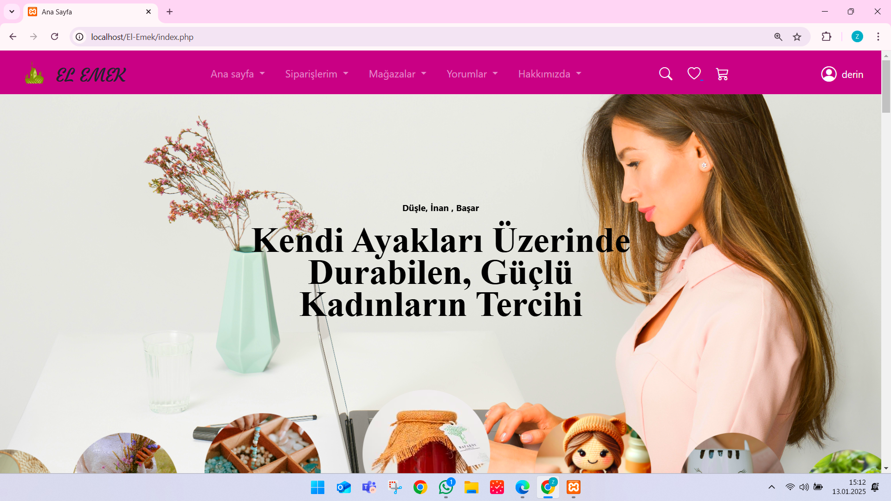
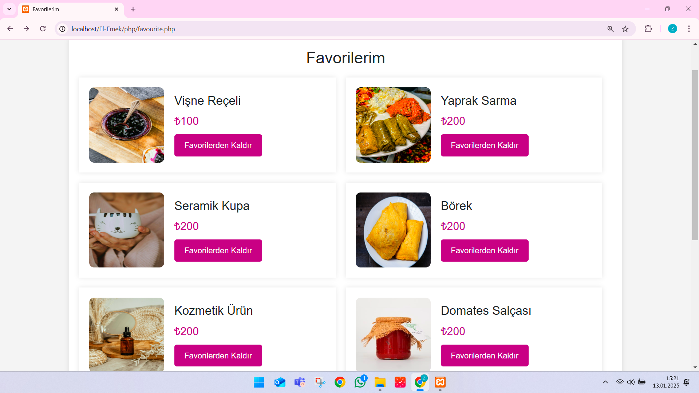
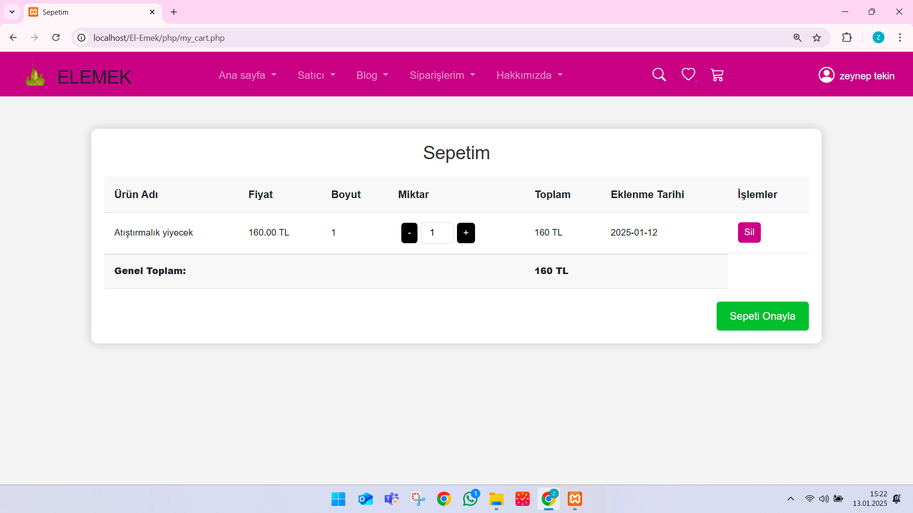
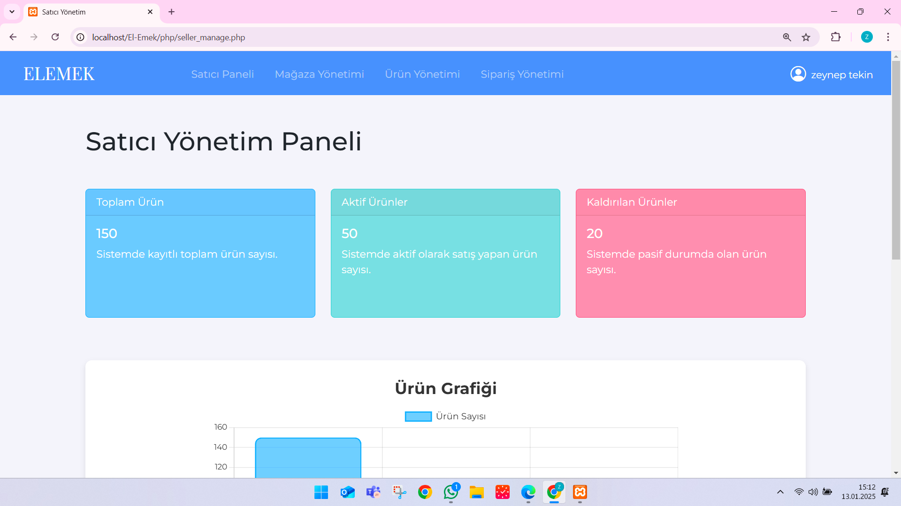
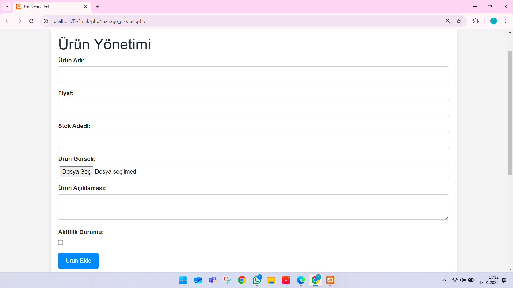
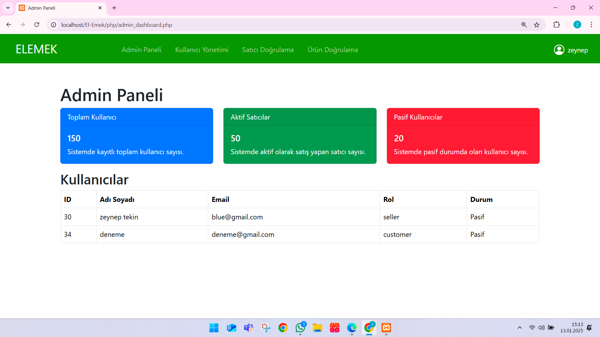
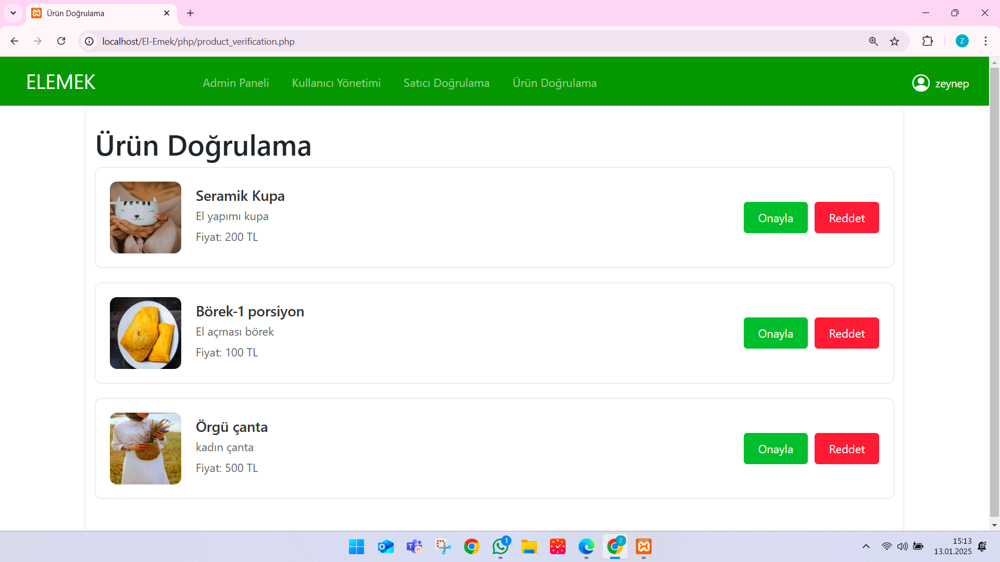

# E-Ticaret Platformu- EL EMEK

Bu proje, PHP ve MySQL kullanarak bir e-ticaret platformunun temel işlevselliklerini geliştirmek amacıyla oluşturulmuştur. Proje, satıcı, müşteri ve admin rolleri için farklı yetki ve işlevler sağlayan bir yapı sunar. Aşağıda, proje hakkında detaylı bilgiler yer almaktadır.

## Projenin Özeti
Bu platformda:
- Müşteriler ürünleri inceleyebilir, sepetlerine ekleyebilir ve sipariş oluşturabilirler.
- Satıcılar ürün ekleyebilir, ürünlerini yönetebilir ve siparişleri görüntüleyebilir.
- Admin, kullanıcıları ve içerikleri yönetebilir, ürün ve satıcı doğrulamalarını gerçekleştirebilir.

## Kullanılan Teknolojiler
- **Backend**: PHP
- **Frontend**: HTML, CSS, JavaScript (Bootstrap ile zenginleştirilmiş)
- **Veritabanı**: MySQL
- **Proje Yönetimi ve Tasarım Araçları**: Draw.io ve Miro

## ER Diyagramı
Projede kullanılan veritabanı tasarımı, aşağıdaki gibi ilişkilere sahiptir:
- Bir alışveriş sitesi birden fazla kategori içerir.
- Bir kategori birden fazla ürünü barındırabilir ve bir ürün birden fazla kategoriye ait olabilir.
- Satıcılar ürünleri ekler ve sipariş süreçlerini yönetir.
- Müşteriler sipariş oluşturabilir, siparişlere ait ödemeler yapabilir ve siparişlerin durumunu takip edebilir.
- Tüm ilişkiler hakkında detaylı bilgi için [ER Diyagramına](https://miro.com/welcomeonboard/WWlJbGpDalBXck1tQUg2Y0R6cXlhL0d3L21GSytHanRRVStHVk5qOWt4WTJud1ZDdmNYejE3QStjTm1BamdTaDJDcXNGV3VDUExSVVNjdE5vd1dSc2U2TnlzUUpkV1J4KzBDT1E3aDd1ZHcxZmg1a08xWjYyVkdML2E0TGtvVGMhZQ==?share_link_id=771749444343) göz atabilirsiniz.

## Veritabanı Şeması
Veritabanı yapısı hakkında detaylı bilgiye ulaşmak için [Veritabanı Şeması](https://drive.google.com/file/d/1JkfOY0usNt4UlgF4rtcPlg_cIFzgvn2Q/view?usp=sharing) bağlantısını kullanabilirsiniz.

## Proje Rolleri ve Görevleri
### 1. Admin
- Kullanıcıların ve içeriklerin genel yönetimi.
- Satıcı ve ürün doğrulama işlemleri.
- Şikayet ve iade süreçlerinin yönetimi.

### 2. Satıcı
- Ürün ekleme, düzenleme ve silme işlemleri.
- Müşteri siparişlerini görüntüleme ve süreçlerini yönetme.

### 3. Müşteri
- Ürünleri inceleme, sepete ekleme ve sipariş oluşturma.
- Sipariş durumunu takip etme.

## Projede Yapılanlar
- Kullanıcı giriş ve kayıt sistemi:
  - **Role-based Access Control** (Rol bazlı erişim kontrolü) ile kullanıcı rolleri ayrıştırıldı (Admin, Satıcı, Müşteri).
  - Kullanıcılar giriş yaparken kimlik doğrulama sistemi (şifreleme ile) uygulandı.
- Satıcılar için:
  - Ürün ekleme, düzenleme ve silme işlemleri.
  - Siparişleri görüntüleme ve süreçleri yönetme ekranı.
- Müşteriler için:
  - Ürün inceleme ve sepete ekleme işlemleri.
  - Sipariş ve ödeme yönetimi.
- Admin için:
  - Kullanıcı ve ürün yönetimi.
  - Şikayet ve iade süreçlerinin kontrolü.

## Kullanılan Tasarım ve Responsive Özellikler
- **Bootstrap**: Navigasyon çubuğu ve genel düzenleme için kullanıldı.
- **Custom CSS**: Ürün kartlarının boyutları eşitlendi, grid yapısı ile düzenli bir görünüm sağlandı.
- **Responsive Design**: Tüm ekran boyutları için uyumluluk sağlandı.

## Önemli Dosyalar ve Açıklamaları
- `seller_dashboard.php`: Satıcıların mağaza ve ürün yönetimi paneli.
- `manage_product.php`: Ürünlerin eklenmesi ve düzenlenmesi.
- `order_manage.php`: Siparişlerin görüntülenmesi ve yönetimi.
- `admin_dashboard.php`: Admin kullanıcı yönetim paneli.

## Kurulum ve Kullanım
1. **Veritabanı Kurulumu**:
   - `database.sql` dosyasını kullanarak veritabanını oluşturun.
   - `users`, `satici`, `urun` gibi tabloların doğru şekilde tanımlandığından emin olun.

2. **Kodların Çalıştırılması**:
   - PHP ve MySQL desteği sağlayan bir sunucu (örn. XAMPP) kullanarak projeyi çalıştırın.
   - `index.php` üzerinden projeye erişim sağlayabilirsiniz.

3. **Giriş Yapma**:
   - Kullanıcılar rol bazlı giriş yaparak (admin, satıcı, müşteri) farklı panellere yönlendirilir.

## Gelecekteki İyileştirme Önerileri
- Kullanıcı doğrulama için SMS veya e-posta entegrasyonu.
- Ödeme sistemleri için üçüncü taraf API'lerin entegrasyonu.
- Daha gelişmiş bir filtreleme ve arama özelliği.

## Katkıda Bulunanlar
- **Kevser Semiz** - Frontend geliştirme ve tasarım
- **Zeynep Nuriye Tekin** - Veritabanı, frontend ve backend geliştirme.
- **Fatma Hümeyra Gül** - Veritabanı Temel Yapısını kurma ve tasarım

## Ekran Görüntüleri

### 1. Müşteri Paneli - Ana Sayfa

### 2. Ana Sayfa- Ürünler

### 3. Favorilerim

### 4. Sepetim

### 5. Satıcı Paneli - Mağaza

### 5. Satıcı Paneli - Ürün Yönetimi

### 5. Satıcı Paneli - Ürün Ekle

### 5. Admin Paneli - Kullanıcı Yönetimi

### 5. Admin Paneli - Ürün Yönetimi

